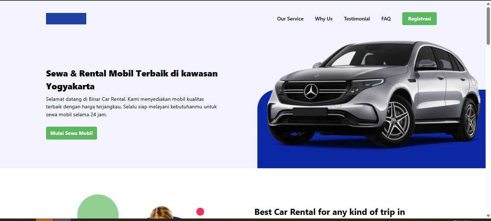
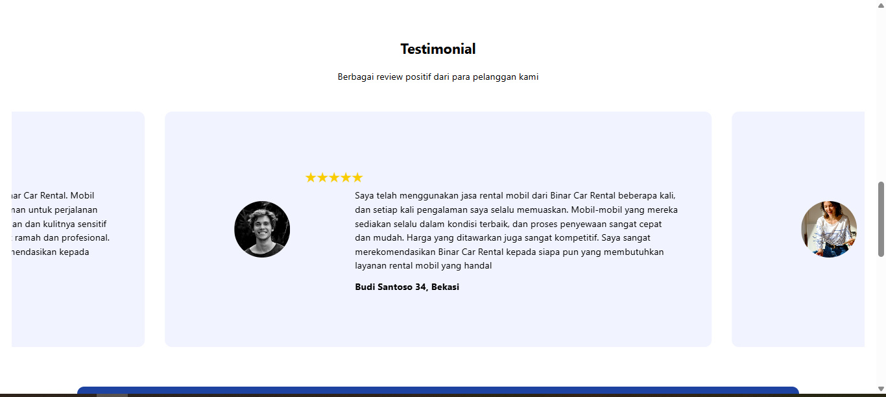
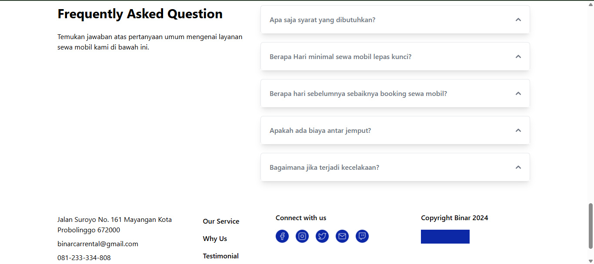
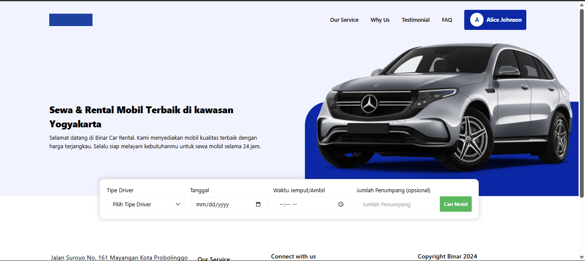
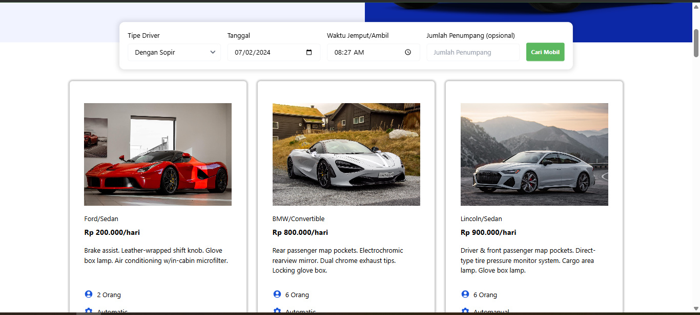
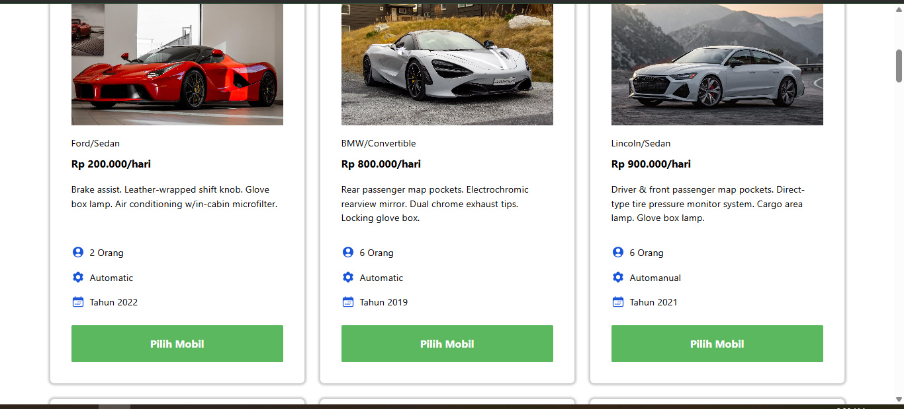
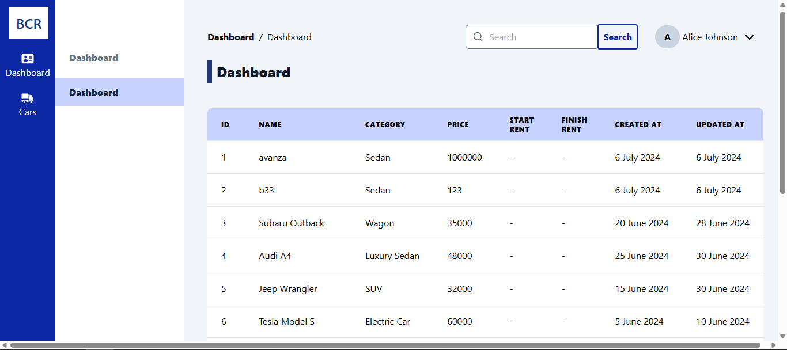
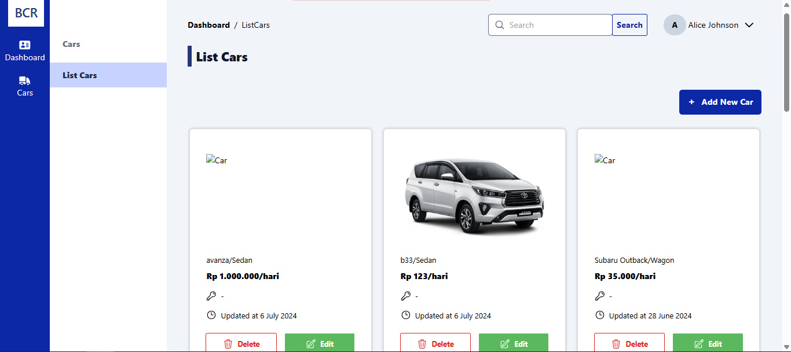
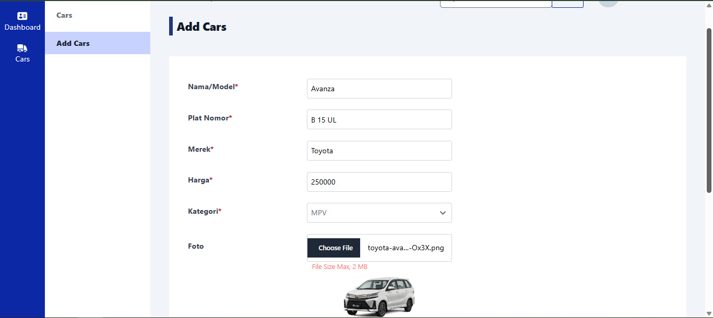
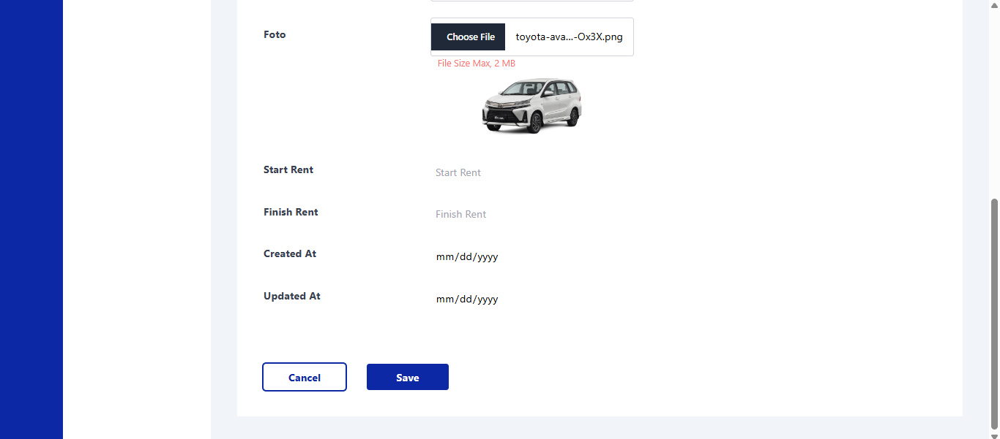

# 🚗 Binar Car Rental - Web Application


Aplikasi web modern untuk layanan rental mobil yang dibangun dengan React, TypeScript, dan Vite. Proyek ini merupakan bagian dari SYNRGY Academy Chapter 7 Challenge, menyediakan platform lengkap untuk pelanggan menyewa mobil dan admin mengelola inventori kendaraan.

## 📋 Daftar Isi

- [Fitur Utama](#-fitur-utama)
- [Demo & Deployment](#-demo--deployment)
- [Screenshot](#-screenshot)
- [Teknologi](#-teknologi)
- [Struktur Proyek](#-struktur-proyek)
- [Instalasi](#-instalasi)
- [Penggunaan](#-penggunaan)
- [Testing](#-testing)
- [Konfigurasi](#-konfigurasi)
- [API Integration](#-api-integration)
- [Kontribusi](#-kontribusi)
- [Lisensi](#-lisensi)

## ✨ Fitur Utama

### 🔐 Autentikasi & Otorisasi
- Login dan Register dengan validasi form
- Integrasi Google OAuth untuk sign-in cepat
- JWT-based authentication
- Protected routes untuk user dan admin
- Role-based access control (RBAC)

### 👥 Fitur User
- **Landing Page**: Halaman utama dengan informasi lengkap layanan
- **Car Search**: Pencarian mobil berdasarkan kriteria (tipe, tanggal, waktu)
- **Browse Cars**: Menampilkan daftar mobil yang tersedia
- **Testimonials**: Ulasan pelanggan
- **FAQ Section**: Pertanyaan yang sering ditanyakan
- **Why Choose Us**: Keunggulan layanan

### 👨‍💼 Fitur Admin Dashboard
- **Dashboard Overview**: Ringkasan data dan statistik
- **Car Management**: CRUD operations untuk data mobil
  - Tambah mobil baru
  - Edit informasi mobil
  - Hapus mobil
  - Upload gambar mobil
- **Data Table**: Tabel data dengan sorting dan filtering
- **Notification System**: Notifikasi untuk setiap aksi

### 🎨 UI/UX Features
- Responsive design (Mobile, Tablet, Desktop)
- Modern dan intuitive interface
- Loading states dan error handling
- Modal notifications
- Smooth transitions dan animations

## 🌐 Demo & Deployment

### Live Demo
- **Frontend**: [https://bcr-ch7-daniel.netlify.app/](https://bcr-ch7-daniel.netlify.app/)
- **Backend API**: [https://bcr-api-ch7-4v2butogya-uc.a.run.app/](https://bcr-api-ch7-4v2butogya-uc.a.run.app/)

### Backend Repository
- [24001143-synrgy7-dhs-bcr_api_docs-ch6](https://github.com/pesuts/24001143-synrgy7-dhs-bcr_api_docs-ch6)

## 📸 Screenshot

### Landing Page

*Halaman utama dengan hero section dan informasi layanan*

### Why Choose Us

*Keunggulan dan nilai tambah layanan rental mobil*

### Testimonials

*Testimoni dan ulasan dari pelanggan*

### FAQ Section

*Pertanyaan yang sering ditanyakan dan jawabannya*

### Car Search

*Form pencarian mobil dengan filter lengkap*

### Search Results


*Hasil pencarian mobil yang tersedia*

### Admin Dashboard

*Dashboard admin dengan overview data*

### Dashboard Cards

*Card view untuk data mobil di dashboard*

### Add Car Form


*Form untuk menambahkan mobil baru ke inventory*

## 🛠 Teknologi

### Core Technologies
- **React 18.3.1** - Library JavaScript untuk membangun UI
- **TypeScript 5.5.3** - Superset JavaScript dengan static typing
- **Vite 5.3.1** - Build tool dan development server yang cepat

### UI & Styling
- **TailwindCSS 3.4.4** - Utility-first CSS framework
- **Flowbite 2.4.1** - Component library berbasis Tailwind
- **Heroicons 2.1.4** - Icon set dari Tailwind Labs
- **Owl Carousel** - Carousel/slider untuk testimonials

### State Management & Routing
- **React Router DOM 6.24.0** - Routing untuk SPA
- **React Context API** - State management global

### Authentication
- **@react-oauth/google 0.12.1** - Google OAuth integration
- **jsonwebtoken 9.0.2** - JWT handling
- **jwt-decode 4.0.0** - JWT token decoding

### HTTP Client
- **Axios 1.7.2** - Promise-based HTTP client

### Testing
- **Jest 29.7.0** - JavaScript testing framework
- **@testing-library/react 16.0.0** - React testing utilities
- **@testing-library/jest-dom 6.4.6** - Custom Jest matchers
- **@testing-library/user-event 14.5.2** - User interaction simulation

### Development Tools
- **ESLint** - Linting untuk code quality
- **TypeScript ESLint** - TypeScript linting rules
- **PostCSS & Autoprefixer** - CSS processing

## 📁 Struktur Proyek

```
challenge7-synrgy/
├── public/                          # Static assets
│   ├── _redirects                   # Netlify redirects config
│   └── img/                         # Images (icons, jpg, png, svg)
├── src/
│   ├── __tests__/                   # Unit tests
│   │   ├── CTAButton.test.tsx
│   │   ├── FaqList.test.tsx
│   │   ├── Footer.test.tsx
│   │   ├── InputForm.test.tsx
│   │   └── NavButton.test.tsx
│   ├── assets/                      # CSS dan asset tambahan
│   ├── components/                  # React components
│   │   ├── Elements/                # Atomic components
│   │   │   └── Button/
│   │   ├── Fragments/               # Composite components
│   │   │   ├── Dashboard/
│   │   │   └── ...
│   │   └── Layouts/                 # Layout components
│   │       ├── Dashboard/
│   │       └── ...
│   ├── contexts/                    # React Context providers
│   │   ├── CarsContext.tsx
│   │   └── FindCarContext.tsx
│   ├── middleware/                  # Route protection
│   │   ├── ProtectedRoute.tsx
│   │   ├── ProtectedAdminRoute.tsx
│   │   └── ProtectedAuthRoute.tsx
│   ├── pages/                       # Page components
│   │   ├── dashboard.tsx
│   │   ├── error.tsx
│   │   ├── find-car.tsx
│   │   ├── landing-page.tsx
│   │   ├── login.tsx
│   │   └── register.tsx
│   ├── services/                    # API services
│   │   ├── auth.service.ts
│   │   └── car.service.ts
│   ├── utils/                       # Utility functions
│   │   ├── dateUtils.ts
│   │   └── jwtVerify.ts
│   ├── App.tsx                      # Main App component
│   ├── main.tsx                     # Entry point
│   └── index.css                    # Global styles
├── screenshots/                     # Application screenshots
├── coverage/                        # Test coverage reports
├── jest.config.ts                   # Jest configuration
├── vite.config.ts                   # Vite configuration
├── tsconfig.json                    # TypeScript configuration
├── tailwind.config.js               # Tailwind CSS configuration
├── netlify.toml                     # Netlify deployment config
└── package.json                     # Dependencies dan scripts
```

## 🚀 Instalasi

### Prerequisites

Pastikan Anda telah menginstall:
- **Node.js** (versi 18.x atau lebih tinggi)
- **npm** atau **yarn** atau **pnpm**
- **Git**

### Clone Repository

```bash
git clone https://github.com/pesuts/pesuts-24001143-synrgy7-dhs-bcr_react-ch7.git
cd challenge7-synrgy
```

### Install Dependencies

Menggunakan npm:
```bash
npm install
```

Menggunakan yarn:
```bash
yarn install
```

Menggunakan pnpm:
```bash
pnpm install
```

### Environment Variables

Buat file `.env` di root directory dan tambahkan variabel berikut:

```env
VITE_API_URL=your_api_url
VITE_GOOGLE_CLIENT_ID=your_google_oauth_client_id
```

## 💻 Penggunaan

### Development Mode

Jalankan development server dengan hot-reload:

```bash
npm run dev
```

Aplikasi akan berjalan di `http://localhost:5173`

### Build untuk Production

```bash
npm run build
```

Build output akan tersimpan di folder `dist/`

### Preview Production Build

```bash
npm run preview
```

### Linting

```bash
npm run lint
```

## 🧪 Testing

### Run Tests

Menjalankan semua test:
```bash
npm run test
```

Menjalankan test dalam watch mode:
```bash
npm run test:watch
```

### Test Coverage

Test coverage mencakup komponen-komponen penting:
- ✅ CTAButton Component
- ✅ NavButton Component
- ✅ FaqList Component
- ✅ Footer Component
- ✅ InputForm Component

Coverage report tersimpan di folder `coverage/`

## ⚙️ Konfigurasi

### Vite Configuration

```typescript
// vite.config.ts
import { defineConfig } from "vite";
import react from "@vitejs/plugin-react";
import path from "path";

export default defineConfig({
  plugins: [react()],
  resolve: {
    alias: {
      "@": path.resolve(__dirname, "./src"),
    },
  },
});
```

### TailwindCSS Configuration

TailwindCSS dikonfigurasi dengan Flowbite plugin untuk component library tambahan.

### TypeScript Configuration

Proyek menggunakan strict mode TypeScript untuk type safety maksimal.

## 🔌 API Integration

### Authentication Endpoints
- `POST /api/auth/login` - User login
- `POST /api/auth/register` - User registration
- `POST /api/auth/google` - Google OAuth login

### Car Endpoints
- `GET /api/cars` - Get all cars
- `GET /api/cars/:id` - Get car by ID
- `POST /api/cars` - Create new car (Admin only)
- `PUT /api/cars/:id` - Update car (Admin only)
- `DELETE /api/cars/:id` - Delete car (Admin only)
- `GET /api/cars/search` - Search cars with filters

### Service Layer

API calls diorganisir dalam service files:
- `auth.service.ts` - Authentication related API calls
- `car.service.ts` - Car management API calls

## 🤝 Kontribusi

Kontribusi selalu diterima! Berikut langkah-langkahnya:

1. Fork repository ini
2. Buat branch fitur baru (`git checkout -b feature/AmazingFeature`)
3. Commit perubahan Anda (`git commit -m 'Add some AmazingFeature'`)
4. Push ke branch (`git push origin feature/AmazingFeature`)
5. Buat Pull Request

### Coding Standards

- Gunakan TypeScript untuk type safety
- Follow ESLint rules yang sudah dikonfigurasi
- Tulis unit tests untuk komponen baru
- Gunakan conventional commits
- Dokumentasikan perubahan penting

## 📝 Lisensi

Proyek ini dibuat untuk keperluan pembelajaran dalam SYNRGY Academy Bootcamp.

## 👨‍💻 Author

**Daniel Hermawan Saputra**
- GitHub: [@pesuts](https://github.com/pesuts)
- SYNRGY Batch 7 - Challenge Chapter 7

## 🙏 Acknowledgments

- SYNRGY Academy untuk guidance dan mentoring
- Instruktur dan mentor yang telah membimbing
- Teman-teman bootcamp untuk kolaborasi dan support
- React community untuk resources dan dokumentasi

---

**Built with ❤️ using React + TypeScript + Vite**

© 2024 Binar Car Rental. All rights reserved.